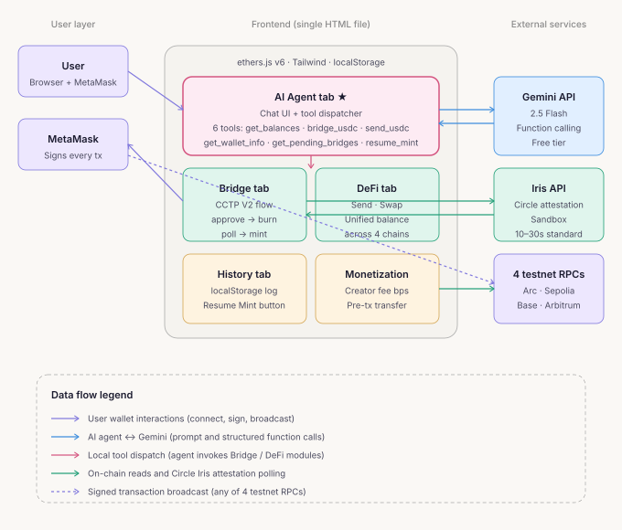

# Arc Agentic USDC — AI Agent + Real CCTP V2

> **Stablecoins Commerce Stack Challenge submission · Track 4: Agentic Economy**

A working multi-chain USDC dApp where an **AI agent** plans and executes real on-chain transactions on behalf of the user. Built as a single static HTML file, integrating Circle's official CCTP V2 contracts and Gemini's function-calling API.

🔗 **Live demo:** _[your Vercel URL]_
📂 **Repo:** _[your GitHub URL]_

---

## TL;DR for judges

- 🤖 **AI agent** powered by Gemini 2.5 Flash with 4 on-chain tools (`get_balances`, `bridge_usdc`, `send_usdc`, `get_wallet_info`) — talk to it in natural language, it executes real testnet transactions
- 🌉 **Real CCTP V2 bridge** across 5 testnets (Arc, Pharos, Ethereum Sepolia, Base Sepolia, Arbitrum Sepolia) — full `approve → burn → attestation → mint` flow with Circle Iris API
- 💸 **Real ERC-20 USDC transfers** on any chain
- 📊 **Real multi-chain balance aggregation** via parallel on-chain `balanceOf` queries
- 💰 **Built-in monetization** — Arc App Kit's creator-fee pattern, configured via UI, split off as a separate transfer before each main transaction
- ⛽ **Real gas estimation** before signing
- 📜 **Transaction history** with explorer links, status tracking

Single HTML file. No build step. No backend code. ~2,700 lines.

---

## What it demonstrates for Track 4

The track asks for *"autonomous economic experiences where AI agents can research, negotiate, and execute transactions using onchain rails and programmable payment logic."* This demo addresses three of the listed examples directly:

1. **AI agent autonomously executing stablecoin-settled actions** — Ask "What's my balance on every chain?" or "Bridge 1 USDC from Sepolia to Arc" — the agent plans, calls the appropriate on-chain function, and reports the result.
2. **Automated workflows with budgeting & payment authorization** — The agent checks balances before transactions, refuses if amounts exceed available funds, and **every transaction still requires explicit user wallet signature** (the agent never holds keys).
3. **AI-driven payment routing across chains** — Multi-step prompts like *"Find the chain with the most USDC and move 50% to Arc"* — the agent reasons across chains, plans the bridge, and executes via CCTP V2.

### What makes this different from other AI agent demos

Most "AI agent" demos in this space stop at *talking about* transactions. **This one signs and sends them.** Every tool call resolves to a real on-chain transaction visible on the appropriate block explorer.

---

## Architecture



See [`architecture.svg`](./architecture.svg) for a detailed view.

**Data flow:**
1. **User → Agent UI**: natural language prompt
2. **Frontend → Gemini API**: prompt + function schema for the 4 tools
3. **Gemini → Frontend**: either text reply or `functionCall` with structured args
4. **Frontend dispatches** the tool call locally:
   - `get_balances` → parallel `balanceOf` via `ethers.JsonRpcProvider` on 5 chains
   - `bridge_usdc` → `ensureChain` + `approve` + `depositForBurn` + Iris polling + `receiveMessage`
   - `send_usdc` → `ensureChain` + ERC-20 `transfer`
   - `get_wallet_info` → `eth_chainId` + connected account
5. **MetaMask signs** every transaction — the agent has no key access
6. **Tool result → Gemini → User**: agent summarizes outcome in natural language

---

## Circle products used

| Product | How it's used in this demo |
|---|---|
| **USDC** | Settlement asset across all 5 chains. Used for transfers, bridge value, and creator-fee splitting. |
| **CCTP V2 (Bridge Kit underlying contracts)** | Full burn-and-mint cross-chain bridge: `TokenMessengerV2` for source-chain burn, `MessageTransmitterV2` for destination-chain mint, Iris API for attestation. |

Optional (when user provides Kit Key in UI):
- **Circle Kit Key** — Sent as `Authorization: Bearer ...` header to Iris API attestation polling

---

## Circle Product Feedback

This section is required by the submission rubric. Honest perspective from building this in a few weeks.

### Why I chose these products

- **CCTP V2** was the only viable choice for native USDC cross-chain. Alternatives (liquidity-pool bridges, wrapped tokens) introduce trust assumptions and break the "single USDC across chains" narrative that Arc is built on.
- **USDC as both gas and settlement on Arc** was the killer feature for the agent use case — the agent never has to reason about a separate gas token, which simplifies both the tool schema and the user mental model.
- **No Bridge Kit SDK** — I implemented CCTP V2 directly against the contract ABIs because (a) the demo is browser-only with no bundler, and (b) it forced a deeper understanding of the protocol that paid off when debugging attestation timing.

### What worked well

1. **CCTP V2 testnet contracts are deterministic across all testnets** — `TokenMessengerV2` at `0x8FE6B999Dc680CcFDD5Bf7EB0974218be2542DAA` and `MessageTransmitterV2` at `0xE737e5cEBEEBa77EFE34D4aa090756590b1CE275` work identically on Arc, Pharos, Sepolia, Base Sepolia, and Arb Sepolia. This made adding new chains a 10-line config change — exactly the developer experience CCTP promises.
2. **Iris API v2 endpoint** (`/v2/messages/{domain}?transactionHash=...`) is clean and well-shaped. Returning `status: "complete"` + `message` + `attestation` in one response means a simple poll loop is enough — no separate "is this ready" call.
3. **Domain ID design** — having a stable numeric ID (Arc=26, Pharos=31, etc.) instead of relying on chain IDs keeps the protocol decoupled from network politics.
4. **Standard Transfer (no fee, `maxFee=0`, `minFinalityThreshold=2000`) really does complete in 10–30 seconds** in my testnet observations. That's faster than most third-party bridges' "fast" tier.
5. **Faucet UX is great** — `faucet.circle.com` working for all chains with a single network dropdown is a small thing that matters a lot.

### What could be improved

1. **CCTP V2 testnet contract addresses are not on `developers.circle.com/cctp/references/contract-addresses`** — that page lists only mainnet. I had to find the testnet addresses by reading the *"Transfer USDC on Testnet from Ethereum to Avalanche"* tutorial and inferring (correctly, as it turned out) that they're shared across all V2 testnets. **Recommendation**: add an explicit "Testnet Contract Addresses" sub-section with the same table format as mainnet.
2. **Pharos Testnet domain ID and details are not in the supported-chains page** — I had to confirm domain ID 31 from a third-party blog post. **Recommendation**: when a chain joins CCTP, get it into the official docs same-day.
3. **No deprecation notice on Bridge Kit SDK status** — it's unclear if the JS SDK exists for browser use or only for backend Node.js. I assumed the latter and used raw ethers.js, but a "Browser quick start" example would have saved several hours.
4. **Iris API does not return `Retry-After` header on rate limits** — for client-side polling this means implementing my own exponential backoff. **Recommendation**: standard HTTP rate-limit headers would let SDK consumers handle this without custom logic.
5. **CCTP V2's `depositForBurn` signature changed from V1** (added `destinationCaller`, `maxFee`, `minFinalityThreshold`) but search results often surface the V1 ABI. **Recommendation**: prominently version-flag every code sample on docs.

### Suggestions for developer experience

1. **A canonical "browser quick start"** — a single working HTML file that does `approve + burn + poll + receive` on testnet. This is what I built; having an official one would have cut my learning time in half.
2. **Pre-built React hook for CCTP** — `useBridgeUSDC({ from, to, amount })` returning `{ step, hashes, error }`. Even a tiny wrapper would lower the barrier dramatically.
3. **Iris API webhook callbacks** — instead of polling, let developers register a URL that gets called when attestation is ready. Even a simple SSE endpoint would be a huge UX improvement.
4. **Standardize chain icon URLs** — currently I hardcode emoji flags in the UI; an official chain-icon CDN at `https://cdn.circle.com/chains/arc.svg` etc. would be helpful.
5. **Document the `destinationCaller` use case** — I used `bytes32(0)` for permissionless mint, but a section explaining when to use a non-zero caller (e.g., backend-relayed mints) would unblock more advanced use cases.

---

## Tech stack

| Layer | Choice | Why |
|---|---|---|
| Chain interaction | ethers.js v6 | Wide compat, tiny bundle from CDN |
| AI agent | Gemini 2.5 Flash | Generous free tier, native function calling, low latency |
| UI styling | Tailwind via CDN | No build, instant theming |
| Icons | Inline SVG | Zero icon-CDN dependency |
| Bridge protocol | CCTP V2 | Native burn-and-mint, no LP risk |
| Attestation | Circle Iris API (sandbox) | Official, ~10–30s on Standard |
| State persistence | localStorage | Settings + tx history, no backend needed |

**Notably absent:** wagmi, viem, React, Next.js, any bundler, any backend services. Single ~2,700-line `.html` file plus this README and one SVG.

---

## Quick start

### Run locally
```bash
git clone <repo>
cd <repo>
python3 -m http.server 8080
```
Open <http://localhost:8080>.

### Try the agent
1. Connect MetaMask (wallet auto-adds missing networks)
2. Click **AI Agent** tab
3. Click **Gemini API Key** → get a free key at <https://aistudio.google.com/app/apikey> → paste → Save
4. Try: *"What's my balance on every chain?"* → *"Bridge 1 USDC from Sepolia to Arc"*

### Get test funds
The Bridge tab has links to all relevant faucets. USDC is at <https://faucet.circle.com> for every chain.

### Deploy to Vercel
1. Push this repo to GitHub
2. Vercel → New Project → Import → **Framework Preset: Other** → all other fields blank → Deploy

---

## What's real vs demonstration

Honest table:

| Feature | Real / Demo |
|---|---|
| Connect Wallet (MetaMask) | ✅ Real |
| Network add/switch (5 chains) | ✅ Real |
| Read USDC balances | ✅ Real (parallel `balanceOf`) |
| Bridge USDC via CCTP V2 | ✅ Real (approve → burn → Iris poll → mint) |
| Send USDC | ✅ Real (ERC-20 `transfer`) |
| AI Agent (Gemini function calling) | ✅ Real (4 tools, real on-chain dispatch) |
| Monetization fee transfer | ✅ Real (separate `transfer` before main tx) |
| Gas estimation | ✅ Real (`getFeeData` × gas units) |
| Transaction history | ✅ Real (localStorage of real TX hashes) |
| **Swap (USDC ↔ EURC / cirBTC)** | ⚠️ UI demo — Uniswap/Curve are deployed on Arc Testnet but router addresses are not yet public |

---

## Security notes

- **The agent has no key access** — all transactions go through the user's wallet
- **Kit Key and Gemini API Key are stored only in browser `localStorage`** — never committed to source
- **Recommended**: configure domain whitelist on your Kit Key in Circle Console before sharing your deployment publicly
- **Testnet only** — this codebase is not audited for mainnet use

---

## Roadmap

- **Real Swap** — once Uniswap V3 / Curve testnet router addresses are published for Arc, plug into the existing UI
- **WalletConnect support** — currently stubbed
- **Circle Wallets (embedded wallet)** — for non-crypto-native users who don't have MetaMask
- **Streaming payments** — agent-triggered per-second value transfer using nanopayments (Track 4 stretch goal)

---

## License

MIT.

---

*Built as a single-developer submission to demonstrate that the Arc + Circle developer experience supports real agentic applications today, on testnet, with no enterprise access required.*
